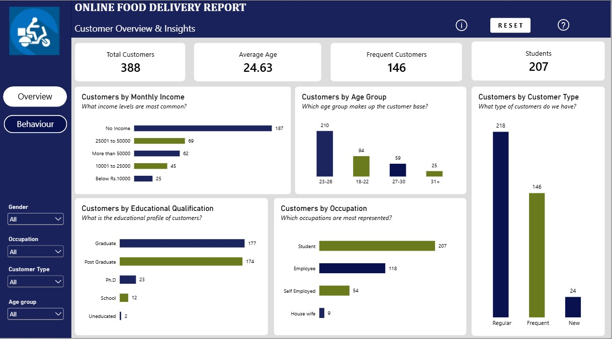
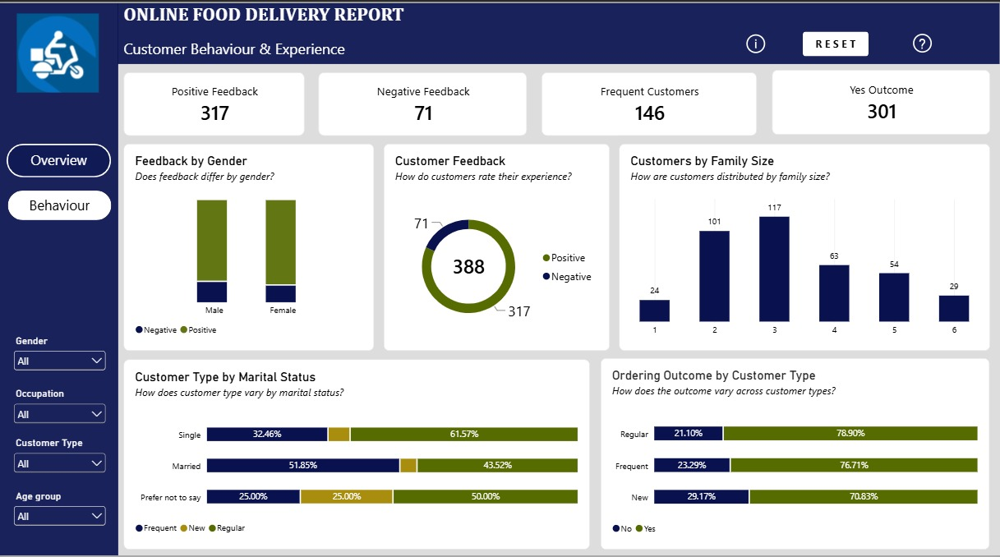

Online Food Delivery Report

An interactive Power BI report analyzing customer demographics, behaviour, and experience within an online food delivery dataset.

Business Questions

* Who are the customers using the online food delivery service?
* How are customers distributed across income, age, education, occupation, and family size?
* How do customers rate their experience?
* Does customer feedback differ by gender?
* How do ordering outcomes vary across different customer types?
* How does customer type vary across marital-status groups?

Key Insights

* Positive feedback was higher than negative feedback, with 317 positive responses compared with 71 negative responses.
* The distribution of positive and negative feedback was relatively similar across male and female customers.
* Ordering outcomes varied across New, Regular, and Frequent customers.
* Customer type showed different distributions across marital status groups.
* Customer distribution varied across different family sizes.
* Customer demographics varied across income, age, education, and occupation.

Recommendations

* Monitor negative feedback and investigate the issues behind negative customer experiences.
* Analyze Frequent and Regular customers to better understand customer retention.
* Use customer characteristics such as income, age, family size, and marital status for customer segmentation.
* Track customer feedback regularly to identify changes in customer experience.
* Further investigate the factors influencing ordering outcomes across different customer types.

Dashboard Pages

Customer Overview

The first dashboard provides an overview of the customer base across demographics and customer characteristics.

Customer Behaviour & Experience

The second dashboard explores customer feedback, ordering outcomes, family size, gender, and customer type across marital-status groups.

Tools Used

* Power BI
* Excel
* Power Query
* DAX
* Data Modeling

Project File

* Online_Food_Delivery_Report.pbix
